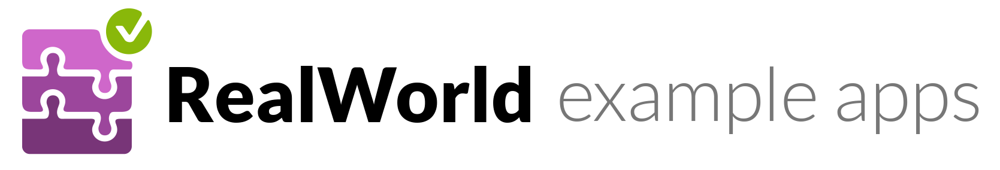

# 

> Fullstack example codebases for React, Angular 2, AngularJS, Node, Rails, Django, and more

Most examples and tutorials only cover simple examples like "todo" apps and rarely show you how to build real world, production ready fullstack apps. They certainly don't cover actually deploying your applications into a production environment either.

To solve this problem, we worked with OSS community leaders to create a series of frontend, backend and deployment codebases & tutorials that can be mixed & matched (the backends all create the same API & the frontends use the same UI templates/styles). Every tutorial teaches you how to build Conduit [(demo)](https://demo.productionready.io), a beautifully designed and fully featured social blogging platform, from scratch. The tutorials also teach you best practices & expert protips for each stack as well as how to deploy it to production environments on AWS, Heroku, and more.

**NOTE: Everything here is still a WIP -- PR's and issues welcome!**

## Supported stacks
> These are continually kept up to date and we're always looking to add more -- PR's and issues welcome!

- Frontend
  - **Angular 2**
    - [Github Repo](https://github.com/GoThinkster/realworld-angular2-example-app)
  - **React / Redux**
    - [Github Repo](https://github.com/GoThinkster/realworld-react-redux-example-app)
  - **Angular 1.5+ (ES6)**
    - [Github Repo](https://github.com/gothinkster/productionready-angularjs-client)
    - [Tutorial](https://thinkster.io/angularjs-es6-tutorial)
- Backend
  - **Node**
    - [Github Repo](https://github.com/gothinkster/realworld-node-express-example-app)
  - **Django**
    - [Github Repo](https://github.com/gothinkster/realworld-django-example-app)
  - **Rails**
    - [Github Repo](https://github.com/gothinkster/realworld-rails-example-app)

## How this works

- Every tutorial is built against the same [API spec](API.md) to ensure modularity of every frontend & backend 
- Every frontend utilizes the same hand crafted Bootstrap 4 theme for identical UI/UX
- There is a hosted version of the backend API available for public usage, no API keys required

## Who made this?

ProductionReady wouldn't be possible without the help of the open source community reviewing codebases, creating new app implementations, and many other tasks that help push this project forward. We especially appreciate the OSS leaders who have helped contribute to ProductionReady:

- **Val Karpov** (core contributor of Mongoose) created the React/Redux codebase and authored its accompanying tutorial
- **Dan Abramov** (creator of Redux) for [sparking the initial idea](https://twitter.com/dan_abramov/status/692009757775896577), [getting the Redux community involved](https://github.com/reactjs/redux/issues/1353), as well as graciously taking the time to provide feedback on the Redux codebase
- **James Brewer** (docs contributor to Django) for countless brainstorming sessions, helping name this project, and creating the Django codebase + tutorial
- **Max Lynch** (creator of Ionic) for taking the time to provide guidance in the early days of this project

**In addition, the core creators are [Eric Simons](https://twitter.com/ericsimons40) and [Albert Pai](https://twitter.com/iamalbertpai)** &mdash; childhood best friends and cofounders of [Thinkster.io](https://thinkster.io). Thinkster funds this entire project, so please consider investing in [a Pro subscription](http://) to **support the ongoing development of ProductionReady**!

## License
All of the codebases in the stacks folder are **MIT licensed** unless otherwise specified.

Docs in this repo are [Creative Commons](https://creativecommons.org/licenses/by-nc-sa/4.0/) licensed.
